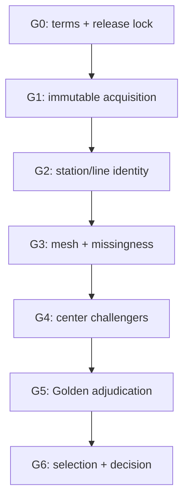

# Phase 1 Execution Plan

**Objective:** build an auditable eight-corridor pilot that tests center identity,
adaptive boundaries, Scale/Type/Access/Confidence separation, and Golden Eval behavior.
**Out of scope:** final 1都3県 ranking, production classes, public UI, paid human-flow data.

## Exit definition

Phase 1 is complete when all eight corridors have source-locked, duplicate-free canonical
station/line/center candidates; algorithms A/B/C/D/E have comparable evaluation artifacts;
and a written GO/REVISE/STOP decision identifies the extraction method for Phase 2.

## Gate sequence

No later gate may compensate for failure in an earlier gate.

## G0 — Reconfirm licenses and releases

### Work

- Re-open every URL in `SOURCES.yml` on acquisition day.
- Record terms-page hashes/screenshots or archived metadata where permitted.
- Check N02/S12/L01 correction logs and e-Stat table-definition revisions.
- Approve only official-host URLs; flag redirects to an unrecorded host.

### Pass criteria

- `license.resolved=true` remains justified for all acquired files.
- reference, publication, and retrieval dates are separately populated.
- L01 is known to be later than the 2026-04-24 correction.

### STOP

Unknown third-party rights, an unexplained revision, or a missing table definition.

## G1 — Immutable acquisition and source lock

### Work

- Download N02, S12, four L01 prefecture archives, and only the JGD2011 Economic/Census
  mesh partitions intersecting the analysis extent.
- Save originals outside Git as read-only objects.
- Record final URL, HTTP metadata, bytes, SHA-256, archive member names, encoding, and
  decompressor version in a machine-readable lockfile.
- Run archive safety checks before extraction.

### Outputs

- `data/manifests/source_lock.phase1.yml`
- `data/manifests/archive_members.phase1.parquet`
- acquisition log with zero unregistered files

### Pass criteria

- every transformed row can resolve to a `source_release_id` and source record;
- repeated acquisition of the same release yields the registered bytes or an explicit revision.

## G2 — Station, group, hub, and line identity

**Status: PASS (2026-08-31).** The 12 queued identity/hub cases are resolved with
official evidence, and all eight exact service segments are locked by station order
and N02 source-key hashes. See `docs/PHASE1_G2_IDENTITY_REPORT.md`.

### Work

1. Parse N02 into release-scoped staging tables.
2. Mint opaque IDs; store N02 station/group/operator/route keys only in `entity_alias`.
3. Build `station_group` candidates from N02, then run topology/name/operator checks.
4. Build `hub` candidates from official transfer evidence and explicit manual review;
   never from proximity alone.
5. Resolve the eight human-readable pilot corridors to canonical `line_id` and exact segments.
6. Queue ambiguous, collision, split, and merge cases without guessing.

### Outputs

- `data/derived/stations.parquet`
- `data/derived/station_groups.parquet`
- `data/derived/hubs.parquet`
- `data/derived/lines.parquet`
- `data/derived/station_line_crosswalk.parquet`
- `data/qa/identity_review_queue.parquet`

### Pass criteria

- every pilot station is confirmed or has a reason-coded unresolved record;
- source alias uniqueness constraints pass;
- all eight corridors resolve to exact N02 segments;
- manual resolutions have evidence and author/time provenance.

### STOP

An input row is silently discarded, a source code becomes canonical ID, or an ambiguous
match is auto-selected without a queue record.

## G3 — Mesh normalization and missingness

**Status: READY.** G3 may consume the confirmed G2 station-line crosswalk. Publication,
ranking, and final center geometry remain blocked by later gates.

### Work

- Decode Economic Census 500m middle-industry tables; run broad-industry fallback in parallel.
- Decode 2020 Census totals and suppression relationships.
- Normalize S12 existence/duplicate codes before numeric parsing.
- Normalize post-correction L01 points without spatially filling absent points.
- Materialize the 1都3県 + 10km extent and TX 5km pilot exception flag.
- Test source totals at prefecture/partition level where official control totals exist.

### Outputs

- `data/derived/economic_mesh_500m.parquet`
- `data/derived/population_mesh_500m.parquet`
- `data/derived/station_access_observations.parquet`
- `data/derived/land_price_points.parquet`
- missingness and reconciliation reports

### Pass criteria

- no unknown raw token;
- numeric zero occurs only with `observed_zero`;
- suppressed sources and aggregation destinations do not double count;
- every observation has source/reference/publication/retrieval provenance;
- Core metric allowlist contains no S12, L01, POI, PLATEAU, or human-flow feature.

## G4 — Center extraction challengers

### Work

- Produce the station-radius negative control (A), connected-component baseline (B),
  primary watershed candidate (C), density clustering challenger (D), and component-tree
  challenger (E) from the same locked Core observations.
- Run bandwidth, threshold, missingness, and boundary-buffer perturbations.
- Generate a full merge tree and `center_version` records for every candidate.
- Link station groups to centers with explicit roles; generate deduplicated `line_center_link`.
- Run Core-only and Enhanced-anchor diagnostic versions separately.

### Outputs

- versioned candidate GeoParquet per method/parameter set
- `station_center_link` and `line_center_link` candidates
- stability matrix and topology-difference report
- schematic/manual review maps, not a public application

### Pass criteria

- fixed-radius output is never selected as final geometry;
- each center can trace its supporting cells and parameter manifest;
- `UNIQUE(line_id, center_id, model_run_id)` passes;
- Core/Enhanced geometry is visibly and structurally distinguishable.

## G5 — Golden Eval adjudication

### Work

- Freeze the SHA-256 of the 60-case registry before inspecting model comparisons.
- Have two reviewers adjudicate every high-priority boundary and identity case.
- Produce reference polygons or hierarchical relation judgments with evidence and uncertainty.
- Use only GE001–GE045 for calibration.
- Reveal GE046–GE060 evaluation after parameters and labels are frozen.

### Required tests

- 100% hard pairwise/structural assertions;
- at least 85% soft pairwise assertions;
- at least 80% holdout type agreement;
- all large candidate centers manually audited;
- sensitivity output saved for every feature family removed one at a time;
- no case failure repaired by editing source observations.

### Outputs

- `data/reference/golden_boundaries_v1.geoparquet`
- adjudication log and inter-reviewer disagreement report
- pairwise/type/boundary/stability test reports

## G6 — Method selection and Phase 2 decision

### Decision order

1. Reject any method failing a hard gate.
2. Compare surviving methods using the selection rubric in `CENTER_MODEL.md`.
3. Document systematic failure modes, not only aggregate accuracy.
4. Choose GO, REVISE, or STOP and record the exact parameter/model version.

### Escalation conditions

Evaluate promotion of paid human-flow or additional commercial-facility data only if the
Core baseline shows one of the registered systematic failures:

- soft pairwise result below 85%;
- holdout type agreement below 80%;
- repeated mall/underground underestimation;
- failure to separate transfer-dominant and destination centers;
- unstable major-center boundaries;
- boundary topology collapses when uneven POI is removed.

Promotion requires a new source audit and an explicit Core-vs-Enhanced decision; it may not
quietly modify the Golden Baseline.

## Quality and reproducibility checklist

- Python environment and geospatial library versions locked.
- Deterministic random seeds and locale/encoding recorded.
- Unit tests cover every source missing token and S12 code.
- Integration test rebuilds one small corridor fixture from source lock to candidate center.
- Schema checks run on every Parquet output.
- Golden registry, parameters, and source bundle each have immutable hashes.
- Data transformations and decisions are committed; raw large archives remain external.
- No Google Maps, Tabelog, or other unauthorized scraping.

## Proposed work packages

| Work package | Depends on | Primary deliverable | Review point |
|---|---|---|---|
| WP1 source lock | G0 | acquisition manifest | license/provenance review |
| WP2 identity | WP1 | station-line crosswalk | ambiguous ID review |
| WP3 metric normalization | WP1 | observation tables | missingness/control totals |
| WP4 extraction challengers | WP2–3 | candidate centers | topology/stability review |
| WP5 Golden adjudication | registry freeze | reference judgments | two-reviewer agreement |
| WP6 selection | WP4–5 | Phase 2 decision memo | owner acceptance |

## Phase 1 acceptance record template

The final decision memo must state:

- exact source releases and hashes;
- unresolved identity count and reason distribution;
- selected/rejected extraction methods and evidence;
- hard/soft/type/boundary test results;
- Core-only versus Enhanced deltas;
- known failure modes and confidence treatment;
- whether Phase 2 may assign provisional scale/type outputs;
- whether any STOP condition remains open.
