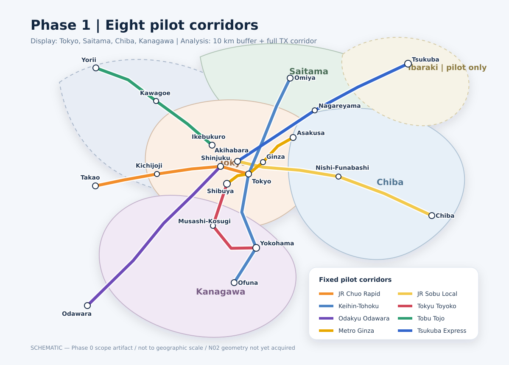

# Phase 1 Pilot Scope

## Fixed scope

初期表示対象は東京都・埼玉県・千葉県・神奈川県である。中心地が行政界で切れ、
密度面にedge biasが生じることを防ぐため、Core surfaceの計算範囲は都県境界から
10km外側までとする。buffer内の中心地は境界処理に使うが、初期公開集計には含めない。

TXだけはモデル検証上の例外として、秋葉原—つくばの全駅列と線形から5kmの回廊を
解析する。茨城県内は「新都市・大型商業施設型」を壊しにいくpilot-only領域であり、
1都3県の集計母集団ではない。

この図はPhase 0の範囲確認用模式図であり、駅位置・路線形状・行政界の測量データではない。
Phase 1ではN02のJGD2011 geometryから別の監査図を再生成する。

## Selected corridors

| # | Corridor | Segment | Main model stress |
|---:|---|---|---|
| 1 | JR中央線快速 | 東京—高尾 | 都心連続面、線状生活中心、郊外核 |
| 2 | JR総武線各駅停車 | 御茶ノ水—千葉 | 県境、乗換主体、東西の中心間隔 |
| 3 | JR京浜東北・根岸線 | 大宮—大船 | 3都県縦断、業務中心、親子中心地 |
| 4 | 東急東横線 | 渋谷—横浜 | 短間隔生活中心、再開発結節点 |
| 5 | 小田急小田原線 | 新宿—小田原 | 郊外勾配、地域核、観光入口 |
| 6 | 東武東上線 | 池袋—寄居 | ターミナル依存、乗換型、小駅前 |
| 7 | 東京メトロ銀座線 | 渋谷—浅草 | 地下駅、複数駅中心、都心階層 |
| 8 | つくばエクスプレス | 秋葉原—つくば | 新都市、モール、公開域外buffer |

銀座線は丸ノ内線との候補比較から固定した。銀座・上野・浅草における短間隔の
複数中心地、地下駅から地上中心へのlink、観光/買物/業務の近接を同時に検証できる
ためである。以後の差し替えにはdecision recordが必要となる。

## Scope rules

- `pilot_corridor_id` は人間可読なscope IDで、canonical `line_id` ではない。
- Phase 1でN02実体を取得し、事業者・路線・対象segmentをaliasとしてopaque IDへ解決する。
- 相互直通はnetwork contextとして保持するが、選定segment外を沿線統計へ混ぜない。
- 同じcenterを複数駅・複数運行系統から参照しても、`line_center_link` は路線ごとに1件。
- bufferとTX例外領域の観測には `display_scope_status` を付ける。
